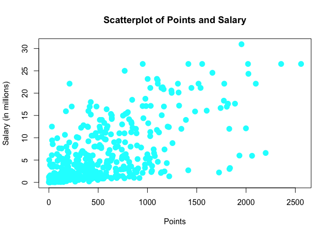
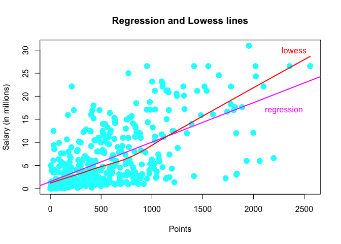
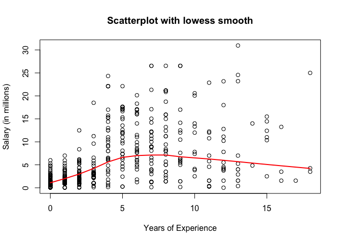
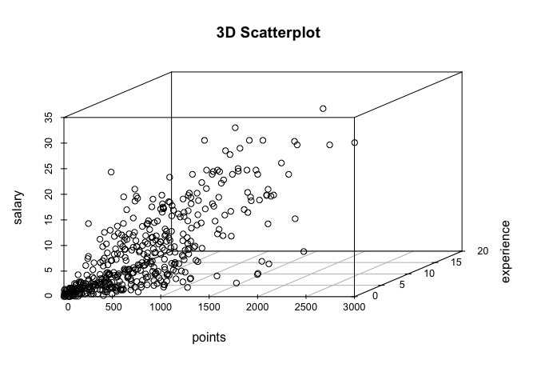
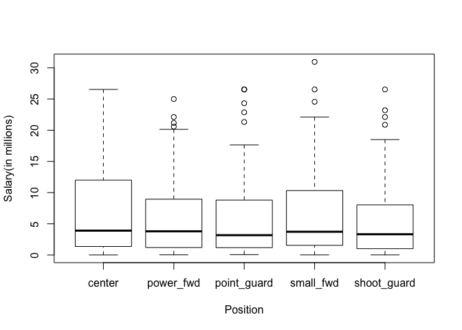

Post01-Katherine-Zhou
================
Katherine Zhou
September 21, 2017

``` r
# data preprocessing
load("data/nba2017-salary-points.RData")
n_salary <- round(salary/10^6, digits = 2)
experience[experience == "R"] <- 0
n_experience <- as.integer(experience)
n_position <- as.factor(position)
levels(n_position)[1:5] <- c("center", "power_fwd", "point_guard", 
    "small_fwd", "shoot_guard")
table(n_position)
```

    ## n_position
    ##      center   power_fwd point_guard   small_fwd shoot_guard 
    ##          89          89          85          83          95

``` r
# scatterplot of points and salary
plot(points, n_salary, pch = 19, col = 373, cex = 1.5, xlab = "Points", 
    ylab = "Salary (in millions)", main = "Scatterplot of Points and Salary")
```



``` r
# 3 correlation between points and salary
n <- length(points)
mean_x <- sum(points)/n
mean_y <- sum(n_salary)/n
var_x <- sum((points - mean_x)^2)/(n - 1)
var_y <- sum((n_salary - mean_y)^2)/(n - 1)
sd_x <- sqrt(var_x)
sd_y <- sqrt(var_y)
cov_xy <- sum((points - mean_x) * (n_salary - mean_y))/(n - 1)
cor_xy <- cov_xy/(sd_x * sd_y)
```

``` r
# simple linear regression
b_1 <- cor_xy * sd_y/sd_x
b_0 <- mean_y - b_1 * mean_x
Y <- b_0 + b_1 * points

summary(Y)
```

    ##    Min. 1st Qu.  Median    Mean 3rd Qu.    Max. 
    ##   1.509   2.844   5.206   6.187   8.184  23.399

``` r
# equation: Y = b_0+b_1*x b_0 is the salary when there is no
# point. b_1 is the money earned per point gain.


# predication of salary x=0 Y=1.51 x=100 2.36 x=500 5.79
# x=1000 10.07 x=2000 18.63
```

``` r
# plotting the regression line
plot(points, n_salary, pch = 19, col = 373, cex = 1.5, xlab = "Points", 
    ylab = "Salary (in millions)", main = "Regression and Lowess lines")
abline(a = b_0, b = b_1, col = 6, lwd = 2)
lines(lowess(points, n_salary), col = 2, lwd = 2)

text(2400, 30, "lowess", col = 2)
text(2300, 17, "regression", col = 6)
```



``` r
# regression residuals and coeff of determination R^2

e <- n_salary - Y
summary(e)
```

    ##    Min. 1st Qu.  Median    Mean 3rd Qu.    Max. 
    ## -14.187  -2.792  -1.095   0.000   2.556  18.814

``` r
RSS <- sum(e^2)
TSS <- sum((n_salary - mean_y)^2)
R2 <- 1 - RSS/TSS
```

``` r
# explore position and experience
plot(n_experience, n_salary, xlab = "Years of Experience", ylab = "Salary (in millions)", 
    main = "Scatterplot with lowess smooth")
lines(lowess(n_experience, n_salary), col = 2, lwd = 2)
```



``` r
library("scatterplot3d")
scatterplot3d(points, n_experience, n_salary, main = "3D Scatterplot", 
    xlab = "points", ylab = "experience", zlab = "salary")
```



``` r
boxplot(n_salary ~ n_position, xlab = "Position", ylab = "Salary(in millions)")
```



``` r
# In the scatterplot, the salary increases with increasing
# experience and with increasing #points. In the boxplot,
# position does not influence the salary much. The min, avg
# and the #first quartile are similar. The #difference is
# larger for the 3rd quartile and max.

# Downloading, installing and loading were always hard for
# me. Plotting was easy. This was the first time I used #git
# and GitHub, I felt that I still need more practice on using
# it. I did #not get a right boxplot and my roommate #teached
# me. I took 3 hours to complete this hw with #nearly same
# time on each part. I did not understand why there #were
# several points greater #than the max line in the boxplot,
# and what the inline code was and how to use it. #There was
# #nothing really frustrating. I felt excited when I got the
# right plots.
```
