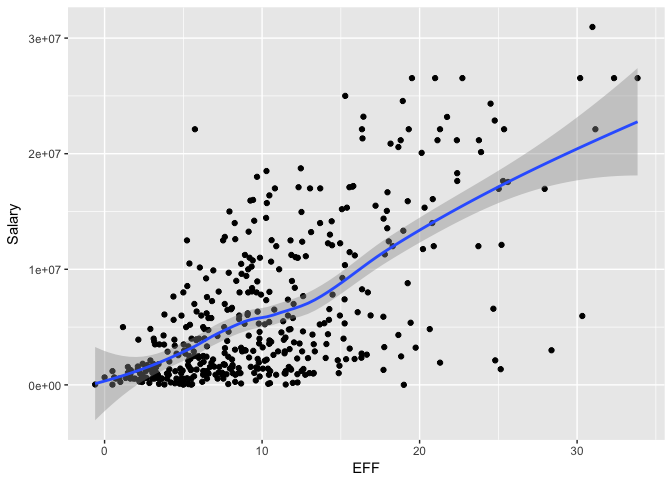

hw02-Katherine-Zhou
================
Katherine Zhou
September 28, 2017

``` r
# download csv file to your working directory (code not
# included) read.csv()
file <- "data/nba2017-player-statistics.csv"
data1 <- data.frame(read.csv(file, header = TRUE, colClasses = c("character", 
    "character", "factor", "character", "double", rep("integer", 
        19))), stringsAsFactors = FALSE)
str(data1)
```

    ## 'data.frame':    441 obs. of  24 variables:
    ##  $ Player      : chr  "Al Horford" "Amir Johnson" "Avery Bradley" "Demetrius Jackson" ...
    ##  $ Team        : chr  "BOS" "BOS" "BOS" "BOS" ...
    ##  $ Position    : Factor w/ 5 levels "C","PF","PG",..: 1 2 5 3 4 3 4 5 4 2 ...
    ##  $ Experience  : chr  "9" "11" "6" "R" ...
    ##  $ Salary      : num  26540100 12000000 8269663 1450000 1410598 ...
    ##  $ Rank        : int  4 6 5 15 11 1 3 13 8 10 ...
    ##  $ Age         : int  30 29 26 22 31 27 26 21 20 29 ...
    ##  $ GP          : int  68 80 55 5 47 76 72 29 78 78 ...
    ##  $ GS          : int  68 77 55 0 0 76 72 0 20 6 ...
    ##  $ MIN         : int  2193 1608 1835 17 538 2569 2335 220 1341 1232 ...
    ##  $ FGM         : int  379 213 359 3 95 682 333 25 192 114 ...
    ##  $ FGA         : int  801 370 775 4 232 1473 720 58 423 262 ...
    ##  $ Points3     : int  86 27 108 1 39 245 157 12 46 45 ...
    ##  $ Points3_atts: int  242 66 277 1 111 646 394 35 135 130 ...
    ##  $ Points2     : int  293 186 251 2 56 437 176 13 146 69 ...
    ##  $ Points2_atts: int  559 304 498 3 121 827 326 23 288 132 ...
    ##  $ FTM         : int  108 67 68 3 33 590 176 6 85 26 ...
    ##  $ FTA         : int  135 100 93 6 41 649 217 9 124 37 ...
    ##  $ OREB        : int  95 117 65 2 17 43 48 6 45 60 ...
    ##  $ DREB        : int  369 248 269 2 68 162 367 20 175 213 ...
    ##  $ AST         : int  337 140 121 3 33 449 155 4 64 71 ...
    ##  $ STL         : int  52 52 68 0 9 70 72 10 35 26 ...
    ##  $ BLK         : int  87 62 11 0 7 13 23 2 18 17 ...
    ##  $ TO          : int  116 77 88 0 25 210 79 4 68 39 ...

``` r
library(dplyr)
```

    ## 
    ## Attaching package: 'dplyr'

    ## The following objects are masked from 'package:stats':
    ## 
    ##     filter, lag

    ## The following objects are masked from 'package:base':
    ## 
    ##     intersect, setdiff, setequal, union

``` r
# read_csv
library(readr)
data2 <- data.frame(read_csv(file, col_types = list(.default = col_integer(), 
    Player = col_character(), Team = col_character(), Position = col_factor(c("C", 
        "PF", "PG", "SF", "SG")), Experience = col_character(), 
    Salary = col_double())), stringsAsFactors = FALSE)
str(data2)
```

    ## 'data.frame':    441 obs. of  24 variables:
    ##  $ Player      : chr  "Al Horford" "Amir Johnson" "Avery Bradley" "Demetrius Jackson" ...
    ##  $ Team        : chr  "BOS" "BOS" "BOS" "BOS" ...
    ##  $ Position    : Factor w/ 5 levels "C","PF","PG",..: 1 2 5 3 4 3 4 5 4 2 ...
    ##  $ Experience  : chr  "9" "11" "6" "R" ...
    ##  $ Salary      : num  26540100 12000000 8269663 1450000 1410598 ...
    ##  $ Rank        : int  4 6 5 15 11 1 3 13 8 10 ...
    ##  $ Age         : int  30 29 26 22 31 27 26 21 20 29 ...
    ##  $ GP          : int  68 80 55 5 47 76 72 29 78 78 ...
    ##  $ GS          : int  68 77 55 0 0 76 72 0 20 6 ...
    ##  $ MIN         : int  2193 1608 1835 17 538 2569 2335 220 1341 1232 ...
    ##  $ FGM         : int  379 213 359 3 95 682 333 25 192 114 ...
    ##  $ FGA         : int  801 370 775 4 232 1473 720 58 423 262 ...
    ##  $ Points3     : int  86 27 108 1 39 245 157 12 46 45 ...
    ##  $ Points3_atts: int  242 66 277 1 111 646 394 35 135 130 ...
    ##  $ Points2     : int  293 186 251 2 56 437 176 13 146 69 ...
    ##  $ Points2_atts: int  559 304 498 3 121 827 326 23 288 132 ...
    ##  $ FTM         : int  108 67 68 3 33 590 176 6 85 26 ...
    ##  $ FTA         : int  135 100 93 6 41 649 217 9 124 37 ...
    ##  $ OREB        : int  95 117 65 2 17 43 48 6 45 60 ...
    ##  $ DREB        : int  369 248 269 2 68 162 367 20 175 213 ...
    ##  $ AST         : int  337 140 121 3 33 449 155 4 64 71 ...
    ##  $ STL         : int  52 52 68 0 9 70 72 10 35 26 ...
    ##  $ BLK         : int  87 62 11 0 7 13 23 2 18 17 ...
    ##  $ TO          : int  116 77 88 0 25 210 79 4 68 39 ...

``` r
# change R to 0 and convert experience to integer
data2[4][data2[4] == "R"] <- 0

data2$Experience <- as.integer(data2$Experience)
str(data2)
```

    ## 'data.frame':    441 obs. of  24 variables:
    ##  $ Player      : chr  "Al Horford" "Amir Johnson" "Avery Bradley" "Demetrius Jackson" ...
    ##  $ Team        : chr  "BOS" "BOS" "BOS" "BOS" ...
    ##  $ Position    : Factor w/ 5 levels "C","PF","PG",..: 1 2 5 3 4 3 4 5 4 2 ...
    ##  $ Experience  : int  9 11 6 0 9 5 4 2 0 6 ...
    ##  $ Salary      : num  26540100 12000000 8269663 1450000 1410598 ...
    ##  $ Rank        : int  4 6 5 15 11 1 3 13 8 10 ...
    ##  $ Age         : int  30 29 26 22 31 27 26 21 20 29 ...
    ##  $ GP          : int  68 80 55 5 47 76 72 29 78 78 ...
    ##  $ GS          : int  68 77 55 0 0 76 72 0 20 6 ...
    ##  $ MIN         : int  2193 1608 1835 17 538 2569 2335 220 1341 1232 ...
    ##  $ FGM         : int  379 213 359 3 95 682 333 25 192 114 ...
    ##  $ FGA         : int  801 370 775 4 232 1473 720 58 423 262 ...
    ##  $ Points3     : int  86 27 108 1 39 245 157 12 46 45 ...
    ##  $ Points3_atts: int  242 66 277 1 111 646 394 35 135 130 ...
    ##  $ Points2     : int  293 186 251 2 56 437 176 13 146 69 ...
    ##  $ Points2_atts: int  559 304 498 3 121 827 326 23 288 132 ...
    ##  $ FTM         : int  108 67 68 3 33 590 176 6 85 26 ...
    ##  $ FTA         : int  135 100 93 6 41 649 217 9 124 37 ...
    ##  $ OREB        : int  95 117 65 2 17 43 48 6 45 60 ...
    ##  $ DREB        : int  369 248 269 2 68 162 367 20 175 213 ...
    ##  $ AST         : int  337 140 121 3 33 449 155 4 64 71 ...
    ##  $ STL         : int  52 52 68 0 9 70 72 10 35 26 ...
    ##  $ BLK         : int  87 62 11 0 7 13 23 2 18 17 ...
    ##  $ TO          : int  116 77 88 0 25 210 79 4 68 39 ...

``` r
Missed_FG <- data2$FGA - data2$FGM
Missed_FT <- data2$FTA - data2$FTM
Point2 <- data2$Points2
Point3 <- data2$Points3
FTM <- data2$FTM
PTS <- Point2 * 2 + Point3 * 3 + FTM
REB <- data2$OREB + data2$DREB
GP <- data2$GP
MPG <- data2$MIN/GP
AST <- data2$AST
STL <- data2$STL
BLK <- data2$BLK
TO <- data2$TO

EFF <- (PTS + REB + AST + STL + BLK - Missed_FG - Missed_FT - 
    TO)/GP
data2 <- cbind(data2, EFF)
str(data2)
```

    ## 'data.frame':    441 obs. of  25 variables:
    ##  $ Player      : chr  "Al Horford" "Amir Johnson" "Avery Bradley" "Demetrius Jackson" ...
    ##  $ Team        : chr  "BOS" "BOS" "BOS" "BOS" ...
    ##  $ Position    : Factor w/ 5 levels "C","PF","PG",..: 1 2 5 3 4 3 4 5 4 2 ...
    ##  $ Experience  : int  9 11 6 0 9 5 4 2 0 6 ...
    ##  $ Salary      : num  26540100 12000000 8269663 1450000 1410598 ...
    ##  $ Rank        : int  4 6 5 15 11 1 3 13 8 10 ...
    ##  $ Age         : int  30 29 26 22 31 27 26 21 20 29 ...
    ##  $ GP          : int  68 80 55 5 47 76 72 29 78 78 ...
    ##  $ GS          : int  68 77 55 0 0 76 72 0 20 6 ...
    ##  $ MIN         : int  2193 1608 1835 17 538 2569 2335 220 1341 1232 ...
    ##  $ FGM         : int  379 213 359 3 95 682 333 25 192 114 ...
    ##  $ FGA         : int  801 370 775 4 232 1473 720 58 423 262 ...
    ##  $ Points3     : int  86 27 108 1 39 245 157 12 46 45 ...
    ##  $ Points3_atts: int  242 66 277 1 111 646 394 35 135 130 ...
    ##  $ Points2     : int  293 186 251 2 56 437 176 13 146 69 ...
    ##  $ Points2_atts: int  559 304 498 3 121 827 326 23 288 132 ...
    ##  $ FTM         : int  108 67 68 3 33 590 176 6 85 26 ...
    ##  $ FTA         : int  135 100 93 6 41 649 217 9 124 37 ...
    ##  $ OREB        : int  95 117 65 2 17 43 48 6 45 60 ...
    ##  $ DREB        : int  369 248 269 2 68 162 367 20 175 213 ...
    ##  $ AST         : int  337 140 121 3 33 449 155 4 64 71 ...
    ##  $ STL         : int  52 52 68 0 9 70 72 10 35 26 ...
    ##  $ BLK         : int  87 62 11 0 7 13 23 2 18 17 ...
    ##  $ TO          : int  116 77 88 0 25 210 79 4 68 39 ...
    ##  $ EFF         : num  19.51 10.9 16.35 2.6 4.81 ...

``` r
summary(EFF)
```

    ##    Min. 1st Qu.  Median    Mean 3rd Qu.    Max. 
    ##  -0.600   5.452   9.090  10.137  13.247  33.840

``` r
hist(EFF)
```


``` r
a <- select(slice(arrange(data2, desc(EFF)), 1:10), Player, Team, 
    Salary, EFF)
a
```

    ## # A tibble: 10 x 4
    ##                   Player  Team   Salary      EFF
    ##                    <chr> <chr>    <dbl>    <dbl>
    ##  1     Russell Westbrook   OKC 26540100 33.83951
    ##  2          James Harden   HOU 26540100 32.34568
    ##  3         Anthony Davis   NOP 22116750 31.16000
    ##  4          LeBron James   CLE 30963450 30.97297
    ##  5    Karl-Anthony Towns   MIN  5960160 30.32927
    ##  6          Kevin Durant   GSW 26540100 30.19355
    ##  7 Giannis Antetokounmpo   MIL  2995421 28.37500
    ##  8      DeMarcus Cousins   NOP 16957900 27.94118
    ##  9          Jimmy Butler   CHI 17552209 25.60526
    ## 10      Hassan Whiteside   MIA 22116750 25.36364

``` r
b <- select(filter(data2, EFF < 0), Player)
b
```

    ##            Player
    ## 1 Patricio Garino

``` r
# cor calculations


c1 <- cor(PTS, EFF)
c2 <- cor(REB, EFF)
c3 <- cor(STL, EFF)
c4 <- cor(AST, EFF)
c5 <- cor(BLK, EFF)
c6 <- cor(-Missed_FT, EFF)
c7 <- cor(-Missed_FG, EFF)
c8 <- cor(-TO, EFF)

cor <- c(c1, c2, c3, c4, c5, c6, c7, c8)
cor <- sort(cor, decreasing = TRUE)
cor
```

    ## [1]  0.8588644  0.7634501  0.6957286  0.6689232  0.5679571 -0.7271456
    ## [7] -0.7722477 -0.8003289

``` r
stats <- c("PTS", "REB", "STL", "AST", "BLK", "Missed_FT", "Missed_FG", 
    "TO")
barplot(cor, main = "Correlations between Players Stats and EFF", 
    names.arg = stats, ylim = c(-1, 1), col = c(rep("grey", 5), 
        rep("red", 3)), border = NA, cex.names = 0.6)
abline(h = 0)
```


``` r
# efficiency and salary
library(ggplot2)
ggplot(data2, aes(x = EFF, y = Salary)) + geom_point() + geom_smooth(method = "loess")
```



``` r
cor(EFF, data2$Salary)
```

    ## [1] 0.655624

``` r
# moderately related. The higher EFF,the higher salary.

library(data.table)
```

    ## 
    ## Attaching package: 'data.table'

    ## The following objects are masked from 'package:dplyr':
    ## 
    ##     between, first, last

``` r
data3 <- cbind(data2, MPG)
dat <- as.data.table(data3)
```

``` r
m <- filter(dat, MPG >= 20)
players2_name <- select(m, Player)
players2_name
```

    ##                       Player
    ## 1                 Al Horford
    ## 2               Amir Johnson
    ## 3              Avery Bradley
    ## 4              Isaiah Thomas
    ## 5                Jae Crowder
    ## 6               Kelly Olynyk
    ## 7               Marcus Smart
    ## 8             Deron Williams
    ## 9                Edy Tavares
    ## 10             Iman Shumpert
    ## 11                J.R. Smith
    ## 12                Kevin Love
    ## 13               Kyle Korver
    ## 14              Kyrie Irving
    ## 15              LeBron James
    ## 16         Richard Jefferson
    ## 17          Tristan Thompson
    ## 18               Cory Joseph
    ## 19             DeMar DeRozan
    ## 20           DeMarre Carroll
    ## 21         Jonas Valanciunas
    ## 22                Kyle Lowry
    ## 23               P.J. Tucker
    ## 24         Patrick Patterson
    ## 25               Serge Ibaka
    ## 26          Bojan Bogdanovic
    ## 27              Bradley Beal
    ## 28                 John Wall
    ## 29             Marcin Gortat
    ## 30           Markieff Morris
    ## 31               Otto Porter
    ## 32           Dennis Schroder
    ## 33             Dwight Howard
    ## 34            Ersan Ilyasova
    ## 35             Kent Bazemore
    ## 36              Paul Millsap
    ## 37           Thabo Sefolosha
    ## 38              Tim Hardaway
    ## 39     Giannis Antetokounmpo
    ## 40               Greg Monroe
    ## 41             Jabari Parker
    ## 42           Khris Middleton
    ## 43           Malcolm Brogdon
    ## 44       Matthew Dellavedova
    ## 45                Tony Snell
    ## 46                C.J. Miles
    ## 47               Jeff Teague
    ## 48          Lance Stephenson
    ## 49               Monta Ellis
    ## 50              Myles Turner
    ## 51               Paul George
    ## 52            Thaddeus Young
    ## 53               Dwyane Wade
    ## 54              Jimmy Butler
    ## 55            Nikola Mirotic
    ## 56               Rajon Rondo
    ## 57               Robin Lopez
    ## 58              Dion Waiters
    ## 59              Goran Dragic
    ## 60          Hassan Whiteside
    ## 61             James Johnson
    ## 62           Josh Richardson
    ## 63           Justise Winslow
    ## 64           Rodney McGruder
    ## 65             Tyler Johnson
    ## 66           Wayne Ellington
    ## 67            Andre Drummond
    ## 68                 Ish Smith
    ## 69                 Jon Leuer
    ## 70  Kentavious Caldwell-Pope
    ## 71             Marcus Morris
    ## 72            Reggie Jackson
    ## 73             Tobias Harris
    ## 74               Cody Zeller
    ## 75            Frank Kaminsky
    ## 76              Kemba Walker
    ## 77           Marco Belinelli
    ## 78           Marvin Williams
    ## 79    Michael Kidd-Gilchrist
    ## 80             Nicolas Batum
    ## 81           Carmelo Anthony
    ## 82              Courtney Lee
    ## 83              Derrick Rose
    ## 84               Joakim Noah
    ## 85        Kristaps Porzingis
    ## 86              Lance Thomas
    ## 87              Aaron Gordon
    ## 88           Bismack Biyombo
    ## 89             Elfrid Payton
    ## 90             Evan Fournier
    ## 91                Jeff Green
    ## 92               Jodie Meeks
    ## 93            Nikola Vucevic
    ## 94             Terrence Ross
    ## 95            Alex Poythress
    ## 96               Dario Saric
    ## 97          Gerald Henderson
    ## 98             Jahlil Okafor
    ## 99            Jerryd Bayless
    ## 100              Joel Embiid
    ## 101          Justin Anderson
    ## 102             Nik Stauskas
    ## 103           Richaun Holmes
    ## 104         Robert Covington
    ## 105         Sergio Rodriguez
    ## 106           T.J. McConnell
    ## 107              Brook Lopez
    ## 108             Caris LeVert
    ## 109         Isaiah Whitehead
    ## 110               Jeremy Lin
    ## 111               Joe Harris
    ## 112  Rondae Hollis-Jefferson
    ## 113          Sean Kilpatrick
    ## 114        Spencer Dinwiddie
    ## 115            Trevor Booker
    ## 116           Andre Iguodala
    ## 117           Draymond Green
    ## 118             Kevin Durant
    ## 119            Klay Thompson
    ## 120              Matt Barnes
    ## 121            Stephen Curry
    ## 122              Danny Green
    ## 123            Kawhi Leonard
    ## 124        LaMarcus Aldridge
    ## 125              Patty Mills
    ## 126                Pau Gasol
    ## 127              Tony Parker
    ## 128             Clint Capela
    ## 129              Eric Gordon
    ## 130             James Harden
    ## 131             Lou Williams
    ## 132         Patrick Beverley
    ## 133            Ryan Anderson
    ## 134             Trevor Ariza
    ## 135            Troy Williams
    ## 136            Austin Rivers
    ## 137            Blake Griffin
    ## 138               Chris Paul
    ## 139           DeAndre Jordan
    ## 140              J.J. Redick
    ## 141           Jamal Crawford
    ## 142         Luc Mbah a Moute
    ## 143           Raymond Felton
    ## 144           Derrick Favors
    ## 145              George Hill
    ## 146           Gordon Hayward
    ## 147               Joe Ingles
    ## 148              Joe Johnson
    ## 149              Rodney Hood
    ## 150              Rudy Gobert
    ## 151             Shelvin Mack
    ## 152           Andre Roberson
    ## 153         Domantas Sabonis
    ## 154              Enes Kanter
    ## 155        Russell Westbrook
    ## 156             Steven Adams
    ## 157               Taj Gibson
    ## 158           Victor Oladipo
    ## 159          Andrew Harrison
    ## 160              James Ennis
    ## 161           JaMychal Green
    ## 162               Marc Gasol
    ## 163              Mike Conley
    ## 164               Tony Allen
    ## 165             Vince Carter
    ## 166            Zach Randolph
    ## 167          Al-Farouq Aminu
    ## 168             Allen Crabbe
    ## 169            C.J. McCollum
    ## 170           Damian Lillard
    ## 171              Evan Turner
    ## 172             Jusuf Nurkic
    ## 173         Maurice Harkless
    ## 174         Danilo Gallinari
    ## 175          Emmanuel Mudiay
    ## 176              Gary Harris
    ## 177             Jamal Murray
    ## 178            Jameer Nelson
    ## 179           Kenneth Faried
    ## 180            Mason Plumlee
    ## 181             Nikola Jokic
    ## 182              Will Barton
    ## 183          Wilson Chandler
    ## 184            Anthony Davis
    ## 185             Axel Toupane
    ## 186         Dante Cunningham
    ## 187         DeMarcus Cousins
    ## 188            E'Twaun Moore
    ## 189          Jordan Crawford
    ## 190             Jrue Holiday
    ## 191             Solomon Hill
    ## 192              Tim Frazier
    ## 193          DeAndre Liggins
    ## 194            Dirk Nowitzki
    ## 195      Dorian Finney-Smith
    ## 196          Harrison Barnes
    ## 197               J.J. Barea
    ## 198             Nerlens Noel
    ## 199               Seth Curry
    ## 200          Wesley Matthews
    ## 201             Yogi Ferrell
    ## 202         Anthony Tolliver
    ## 203            Arron Afflalo
    ## 204              Buddy Hield
    ## 205          Darren Collison
    ## 206           Garrett Temple
    ## 207                 Rudy Gay
    ## 208                Ty Lawson
    ## 209             Tyreke Evans
    ## 210           Andrew Wiggins
    ## 211             Brandon Rush
    ## 212             Gorgui Dieng
    ## 213       Karl-Anthony Towns
    ## 214              Ricky Rubio
    ## 215              Zach LaVine
    ## 216           Brandon Ingram
    ## 217         D'Angelo Russell
    ## 218          Jordan Clarkson
    ## 219            Julius Randle
    ## 220          Larry Nance Jr.
    ## 221                Luol Deng
    ## 222               Nick Young
    ## 223           Timofey Mozgov
    ## 224                 Alex Len
    ## 225           Brandon Knight
    ## 226             Devin Booker
    ## 227             Eric Bledsoe
    ## 228             Jared Dudley
    ## 229          Marquese Chriss
    ## 230              T.J. Warren
    ## 231           Tyson Chandler

``` r
players2 <- data.frame(m)

ggplot(players2, aes(x = EFF, y = Salary)) + geom_point() + geom_smooth(method = "loess")
```


``` r
cor(players2$EFF, players2$Salary)
```

    ## [1] 0.5367224

``` r
# R decreases and it was less correlated than the previous
# one.

# Comments

# Remembering all codes was hard. More practice was needed.
# Whenever I had questions, I searched them in Google and
# learnt myself. It took me two hours to complete this
# assignment and the EFF calculation part was the most time
# consuming. I felt I grasped everything in this assignment.
```
