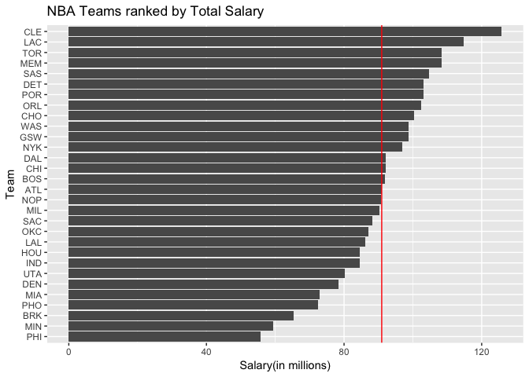
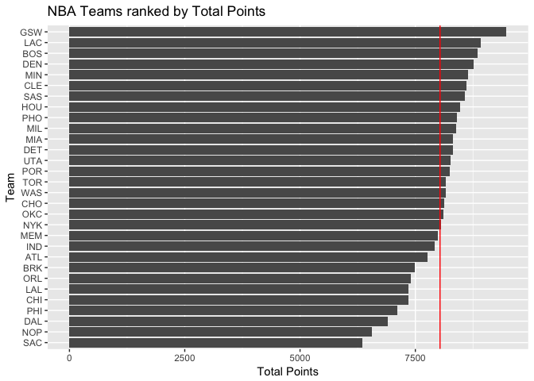
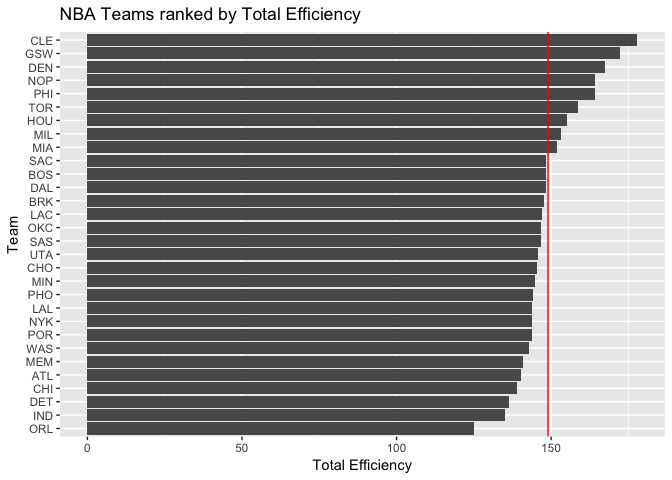
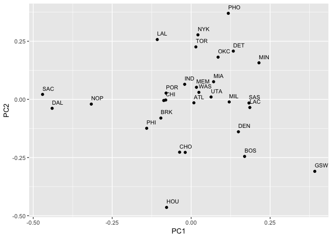
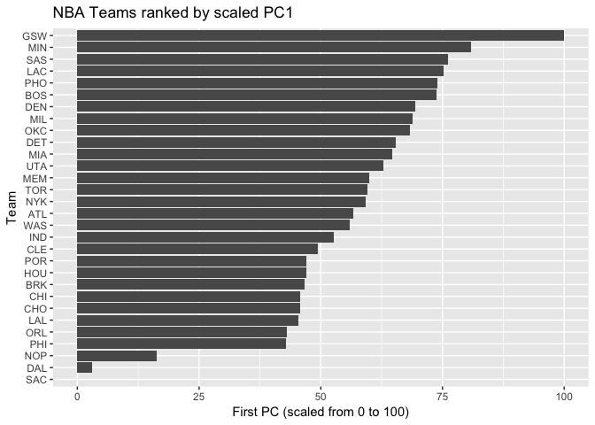

hw03-Katherine-Zhou
================
Katherine Zhou
October 9, 2017

``` r
library(ggplot2)
library(dplyr)
```

    ## 
    ## Attaching package: 'dplyr'

    ## The following objects are masked from 'package:stats':
    ## 
    ##     filter, lag

    ## The following objects are masked from 'package:base':
    ## 
    ##     intersect, setdiff, setequal, union

``` r
setwd("~/desktop/stat133/stat133-hws-fall17/hw03")
dat_t <- read.csv("data/nba2017-teams.csv")
ggplot(dat_t, aes(x = reorder(team, salary), y = salary)) + geom_bar(stat = "identity") + 
    coord_flip() + geom_hline(yintercept = mean(dat_t$salary), 
    color = "red") + labs(title = "NBA Teams ranked by Total Salary", 
    x = "Team", y = "Salary(in millions)")
```



``` r
ggplot(dat_t, aes(x = reorder(team, points), y = points)) + geom_bar(stat = "identity") + 
    coord_flip() + geom_hline(yintercept = mean(dat_t$points), 
    color = "red") + labs(title = "NBA Teams ranked by Total Points", 
    x = "Team", y = "Total Points")
```



``` r
ggplot(dat_t, aes(x = reorder(team, efficiency), y = efficiency)) + 
    geom_bar(stat = "identity") + coord_flip() + geom_hline(yintercept = mean(dat_t$efficiency), 
    color = "red") + labs(title = "NBA Teams ranked by Total Efficiency", 
    x = "Team", y = "Total Efficiency")
```



``` r
# NBA teams with higher total efficiency and total points
# tends to have higher salary. There is some correlation
# existing, but it's not enough to conclude they are causes.
```

``` r
# PCA

dat_sub <- select(dat_t, points3, points2, free_throws, off_rebounds, 
    def_rebounds, assists, steals, blocks, turnovers, fouls)
sub_pca <- prcomp(dat_sub, scale. = TRUE)
sub_eigen <- round((sub_pca$sdev)^2, 4)
sigma_prop <- round(sub_eigen/sum(sub_eigen), 4)
sigma_cumprop <- round(cumsum(sigma_prop), 4)

pca_dataset <- data.frame(eigenvalue = sub_eigen, prop = sigma_prop, 
    cumprop = sigma_cumprop)
pca_dataset
```

    ##    eigenvalue   prop cumprop
    ## 1      4.6959 0.4696  0.4696
    ## 2      1.7020 0.1702  0.6398
    ## 3      0.9795 0.0980  0.7378
    ## 4      0.7717 0.0772  0.8150
    ## 5      0.5341 0.0534  0.8684
    ## 6      0.4780 0.0478  0.9162
    ## 7      0.3822 0.0382  0.9544
    ## 8      0.2603 0.0260  0.9804
    ## 9      0.1336 0.0134  0.9938
    ## 10     0.0627 0.0063  1.0001

``` r
# PCA plot using PC1 and PC2
library(ggplot2)
library(ggfortify)
```

    ## Warning: namespace 'DBI' is not available and has been replaced
    ## by .GlobalEnv when processing object 'quiet'

    ## Warning: namespace 'DBI' is not available and has been replaced
    ## by .GlobalEnv when processing object 'quiet'

``` r
autoplot(prcomp(dat_sub), data = dat_t$teams, label = FALSE) + 
    geom_text(aes(label = dat_t$team), check_overlap = TRUE, 
        hjust = 0, vjust = -1, size = 3)
```



``` r
# PC1 rescaling and plot
teams <- dat_t$team
pca <- prcomp(dat_sub, scale. = TRUE)
z_1 <- pca$rotation[, 1]
pc1_score <- z_1 %*% t(as.matrix(dat_sub))
pc1_score_scale <- 100 * (pc1_score - min(pc1_score))/(max(pc1_score) - 
    min(pc1_score))
n <- mutate(as.data.frame(t(pc1_score_scale)), team = teams)


ggplot(n, aes(x = reorder(team, V1), y = V1)) + geom_bar(stat = "identity") + 
    coord_flip() + labs(title = "NBA Teams ranked by scaled PC1", 
    x = "Team", y = "First PC (scaled from 0 to 100)")
```



``` r
# PC1 gives a better way to distinguish teams based on
# orthogonal basis of correlated variables.

# Comments and Reflections This is the first time I work on
# this kind of project and it is a better way to organize
# file.  No. I used the relative paths before.  No.  PCA is
# hard. I did not understand it. I got help from my friend.
# I took 5 hours to complete this HW.  PCA is the most time
# consuming part and the coord_flip() is interesting and
# easy.
```
